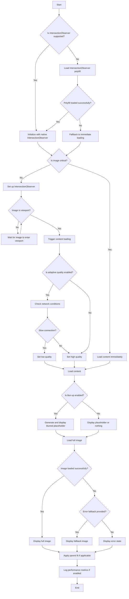

# PreactPixelPerfect Component Flowchart

The following flowchart illustrates the main processes and decision points in the PreactPixelPerfect component. This visual representation helps in understanding the component's flow and functionality at a glance.

## Flowchart Explanation

1. **Initialization**: 
   - The component first checks if the browser supports IntersectionObserver.
   - If not supported, it attempts to load a polyfill.
   - If the polyfill fails to load, it falls back to immediate loading.

2. **Critical Image Handling**:
   - If the image is marked as critical, it's loaded immediately.
   - Otherwise, it sets up lazy loading using IntersectionObserver.

3. **Lazy Loading**:
   - The component waits for the image to enter the viewport before loading.

4. **Adaptive Quality**:
   - If enabled, the component checks network conditions.
   - For slow connections, it loads a lower quality image.

5. **Blur-up Effect**:
   - If enabled, a blurred placeholder is generated and displayed while the full image loads.

6. **Image Loading**:
   - The full image is loaded.
   - If loading fails, it checks for a fallback image or displays an error state.

7. **Final Steps**:
   - Applies parent fit for background images if applicable.
   - Logs performance metrics if enabled.

This flowchart provides a high-level overview of how PreactPixelPerfect works, including its key features like lazy loading, adaptive quality, blur-up effect, and error handling. It's a useful visual aid for understanding the component's logic and can be helpful for both developers working on the component and those integrating it into their projects.
